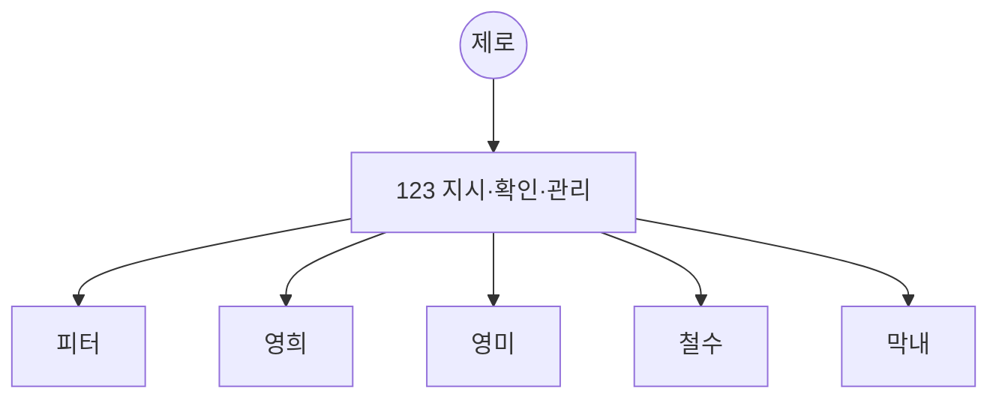
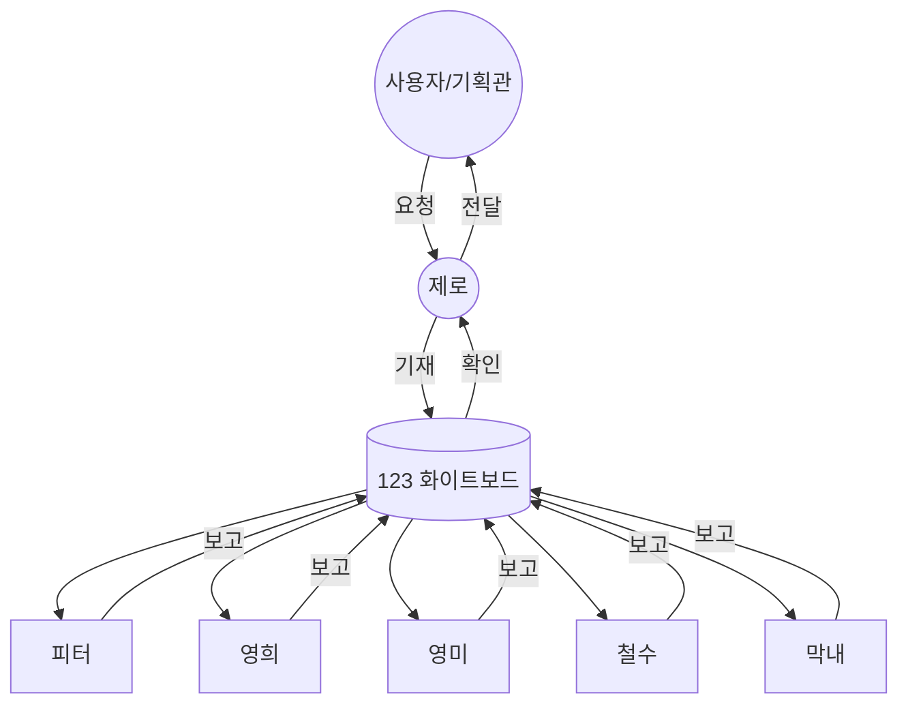
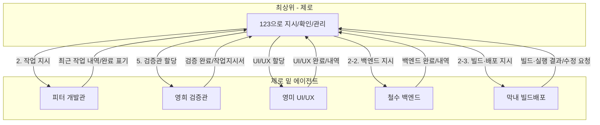
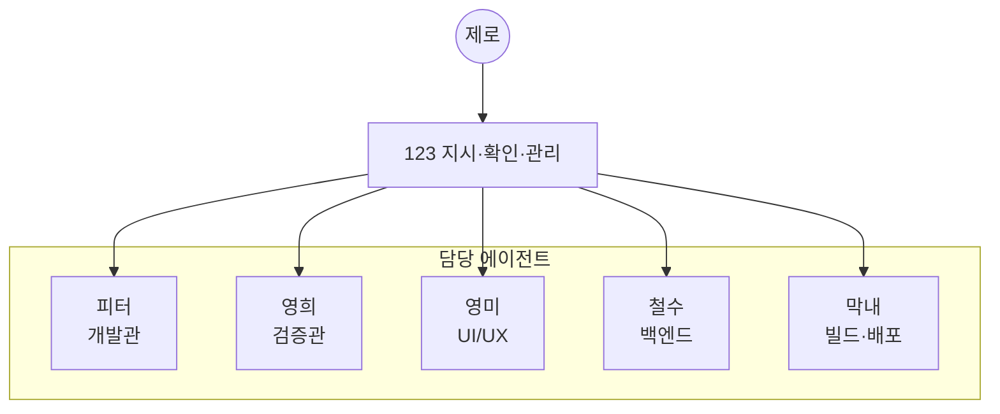
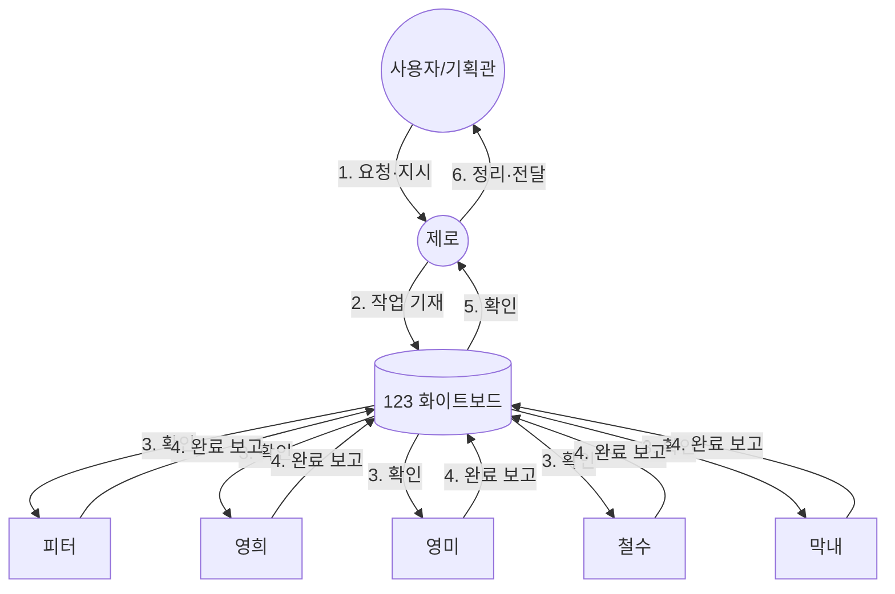

# 123 · 화이트보드

> **이 문서를 "123" 또는 "화이트보드"라고 부릅니다.**  
> 기획관·개발관·검증관이 함께 보는 공용 진도·일정표입니다.  
> 프로젝트: **배짱이 v1.1** · 저작: 차리 (challychoi@me.com)

**에이전트 코드네임**: 최상위 **제로** | 개발관 **피터** | 검증관 **영희** | UI/UX **영미** | 백엔드 **철수** | 빌드·배포 **막내** | 연구원 **최박사** | 연구원 **김박사** | 연구원 **강박사** | 연구원 **챠리** | 연구원 **AI연구원**

**화이트보드 원칙**: 모든 에이전트는 **작업과 관련된 모든 사항**을 화이트보드(123)를 통해서만 공유한다.  
- 해야 할 일 공유 · 작업 내용 공유 · 작업 결과 공유  
- 지시·요청·보고·검증 요청·재작업 지시·진행 상황 등 **이외의 작업 관련 사항도 모두 123을 통한다.**

**지시: 모든 에이전트(피터·영희·영미·철수·막내)는 123(화이트보드)를 읽어보라.** 모든 에이전트는 **자동으로 10초마다 123을 확인**한다. 호출 시 또는 대기 중 123을 확인하고, 본인 담당 섹션과 공통 교육·할 일을 숙지한 뒤 업무에 임한다.

**제로 원칙**: 제로는 **직접 빌드·배포·코딩·검증을 수행하지 않는다.** 제로의 역할은 **사용자와 대화를 계속하는 것**과 **123에 할 일을 기재한 뒤 담당 에이전트를 직접 호출하는 것**이다. 코딩·검증·빌드 등 실행은 모두 피터·영희·영미·철수·막내가 수행하고, 제로는 123에 지시만 적지 말고 **담당자를 직접 호출**해 일을 시킨다.  
**사용자 지시 시**: 사용자가 지시하면 제로는 **각 담당자(피터·영희·영미·철수·막내)를 제로가 직접 호출**한다. 사용자가 채팅으로 일일이 담당자를 부를 필요 없다. 제로가 123에 할 일을 적고, 필요한 담당 에이전트를 **제로가 호출**해 작업·보고하게 한다.  
**큐(쌓인 요청)**: 사용자 질문·요청이 쌓이면 제로는 123에 담당자별로 분배해 적은 뒤 **제로가 직접 해당 담당자들을 호출**해 실행·보고가 이루어지게 한다.

**사용자**: 사용자는 **123만 지켜보며** 프로젝트가 잘 되고 있는지 눈으로 확인한다. 담당 에이전트들의 지시·진행·완료·보고는 모두 123에 적히므로, 123을 보면 진행 상황을 파악할 수 있다.

**담당자 호출**: 담당 에이전트(피터·영희·영미·철수·막내)는 **호출되었을 때만** 동작합니다. **제로가 사용자 지시를 받으면 123에 할 일을 적은 뒤, 제로가 각 담당자를 직접 호출**합니다. 사용자는 담당자를 일일이 부를 필요 없고, 제로에게만 지시하면 됩니다.  
(예: 사용자 "다 호출해" → 제로가 피터·영희·영미·철수·막내를 각각 호출 → 각자 123 확인 후 작업·9-1 보고.)

**종합 보고**: 담당자들이 **작업을 다 끝내면** 제로는 **사용자에게 종합 보고**한다. 9-1 담당자별 작업 보고와 123 갱신 내용을 바탕으로, 담당자별로 무슨 일을 했는지·걸린 시간·결과 요약을 한꺼번에 정리해 사용자에게 전달한다.

---

### 조직도 · 업무플로우 (화이트보드 중심)

**조직도**

**업무플로우 — 모든 소통은 화이트보드를 통함**

---

### 에이전트 공통 교육

아래 내용을 모든 에이전트(피터·영희·영미·철수·막내)가 숙지한다. 이해했으면 **화이트보드 아래 "교육 이수 확인"란에 본인 코드네임으로 「네 교육받았습니다」라고 답변**한다.

---

**프로그램 이름**  
**배짱이** (v1.1) — 업비트 자동매매 앱

**목적**  
- 업비트 거래소 API로 **자동매매** 수행, 스마트폰 앱으로 제어·모니터링  
- 소규모 다중 사용자·개인 투자자 대상, **상용 프로그램** 수준으로 출시

**구조**  
- **앱**: Flutter (Android), 로그인/회원가입·대시보드·포지션·거래내역·설정  
- **서버**: Python FastAPI, SQLite, JWT 인증, 이메일 인증·SMTP, 텔레그램·FCM  
- **CLI**: baejjangi (설정·test mail/telegram/kakao)  
- **협업**: 123 화이트보드로 할 일·내용·결과·지시·보고 등 **모든 작업 관련 사항 공유**

**버전·빌드 명명 규칙 (꼭 기억)**  
- **앱 APK**: 반드시 **baejjangi-버전.apk** 형식으로 빌드·배포 (예: baejjangi-1-4-6.apk). GitHub Actions·로컬 빌드 모두 이 규칙 유지.  
- **앱 버전**과 **엔진 버전**은 **서로 다르다** — 별도 관리. 앱 버전은 pubspec.yaml·백엔드 main.py 등, 엔진 버전은 ant_engine/CMakeLists.txt(개미엔진 AntEngine). 동일하게 맞출 필요 없음.  
- **빌드 시 버전 올리는 법**: 앱은 **0.0.1**씩 올림 (예: 1.4.6 → 1.4.7). 엔진은 **0.1**씩 올림 (예: 0.9 → 1.0).

**그동안의 일 (요약)**  
- 회원가입 스텝 플로우(환영→이메일·닉네임→비밀번호·눈 아이콘→인증코드), 비밀번호 눈 아이콘(로그인·회원가입·비밀번호 변경), 에러 메시지·SMTP 안내 개선  
- 회원가입 버튼 시 로그인 화면 쌓이던 문제 수정(네비게이션·redirect 조정), 앱 실행 후 회색 화면 조치(스플래시·FallbackScaffold)  
- 서버 설치 스크립트·baejjangi CLI(set/test), 인증코드 유효 1분·재발송, API 키 중복 등록 방지  
- 123 화이트보드 전환(txt→md), 에이전트 코드네임(제로·피터·영희·영미·철수·막내), 조직도·업무플로우·화이트보드 원칙 정리

---

**교육 이수 확인**  
이해한 에이전트는 아래 표에 본인 코드네임으로 **「네 교육받았습니다」**라고 화이트보드에 답변한다.

| 코드네임 | 답변 | 일자 |
|----------|------|------|
| 피터 | 네 교육받았습니다 | 2026-03-04 |
| 영희 | 네 교육받았습니다 | 2026-03-04 |
| 영미 | 네 교육받았습니다 | 2026-03-04 |
| 철수 | 네 교육받았습니다 | 2026-03-04 |
| 막내 | 네 교육받았습니다 | 2026-03-04 |

---

## 1. 담당자별 이번에 할 일 (현재) — 쌓인 일 큐

**아래 작업은 담당 에이전트가 Cursor에서 호출되어야 처리·보고됩니다.** 제로만 대화하면 실행되지 않습니다.  
→ **피터·영희·영미·철수·막내(및 기획 에이전트)를 각각 새 채팅에서 호출**해 주세요. 예: "123 확인하고 할 일 해줘" / "개발관 123 보고 지시된 작업 수행 후 123에 보고해줘"

**제로 지시 (오늘)**: **모든 담당 에이전트(피터·영희·영미·철수·막내)는 123의 자기 담당 섹션(2, 2-2, 2-3, 2-4, 5)을 확인한 뒤 자기 할일을 지금 시작하라.** 완료 시 123 「9-1 담당자별 작업 보고」에 추가·갱신.

| 담당 | 코드네임 | 할 일 | 상태 |
|------|----------|--------|------|
| 기획관 | P에이전트 | **최근 트렌드 대비 기획** — 7. 연락·지시의 「제로→기획관 지시」 확인 후 기획·123 보고 | 진행 요청 |
| 개발관 | 피터 | **서버 주소 확인 메시지** + **앱 기본 서버(Jetson) 세팅·설정 서버 주소 바꾸기** 확인·보완 (123 「2」 확인) | [완료!] 2026-03-04 |
| 검증관 | 영희 | **코드·논리·데이터 흐름 검증** + **서버 주소 메시지 원인 조사** — 123 「5」 확인 후 검증·조사·123 보고 | 완료 (2026-03-04) |
| UI/UX 담당 | 영미 | **아이콘 기존 삭제 후 새로 이쁘게 제작·교체** + 화면·색감·배치 가이드 부합 확인 — 123 「2-4」 확인 후 작업·123 보고 | 진행 요청 |
| 백엔드 담당 | 철수 | **baejjangi 실행 파일 컴파일**(옵션 없이 실행 시 --help 안내, set/test 등 옵션 포함·자체 실행) + **백엔드·서버 이상 여부 확인** — 123 「2-2」 확인 후 작업·123 보고 | 진행 요청 |
| 빌드·배포 담당 | 막내 | **로컬 APK 클린 빌드·에뮬레이터 실행** — 123 「2-3」 확인 | [완료!] 2026-03-04 |

---

## 2. 작업 지시 (개발관)

**[완료!] 대시보드 UI 개선 (2026-03-05)** — ① 좌상단 프로필 사진(동그랗게)·별명 ② 총보유자산 상단 표기, 원화잔고 2분할(현금보유고/봇운영보유고·실시간) ③ 금액 한국형식(formatKrw) ④ 봇 실행 시 버튼 2개(매각후 봇정지/현상태 봇정지) ⑤ 주요시세 코인 로고(_CoinLogo)·SOL 추가. 피터 구현·백엔드 stop body(StopBotRequest) 반영.

**[진행중] 개미엔진(AntEngine) v0.9 개발** — 트레이딩 기획(상세_기획서·입출력_연동_가이드) 토대로 엔진 개발. 호칭: 개미엔진, 명칭: AntEngine, 버전: 0.9. **C++17** 단일 바이너리(CMake·nlohmann/json·cpp-httplib). HTTP API: /signal, /health, /version. 입출력 스키마 1.0 준수. v0.9: 검증·이벤트창 보류·손절/익절 매각·진입 골격(hold). 문서: docs/개미엔진_AntEngine.md, ant_engine/README.md. → 피터(엔진 코드)·철수(연동 참고).

진행할 작업이 있으면 아래에 **[진행중]** 으로 추가하고, 완료 시 **[완료!]** + 날짜로 갱신합니다.

| 상태 | 작업명 | 완료일 | 비고 |
|------|--------|--------|------|
| [완료!] | **서버 주소 확인 메시지** — 검증관 조사 결과 반영 수정 | 2026-03-04 | API 서버 주소 설정·기본값·설정 화면·에러 메시지 확인함. 기본값 Jetson, 설정 저장/로드·기동 시 적용·getApiErrorMessage 안내 모두 구현되어 있어 수정 불필요. |
| [완료!] | **앱 기본 서버(Jetson) 세팅 + 설정에서 서버 주소 바꾸기** | 2026-03-04 | api_service defaultBaseUrl=100.80.178.45:8000, app.dart 기동 시 loadStoredBaseUrl 반영, 설정 화면 서버 주소 바꾸기·저장 동작 확인·보완 완료. |
| [완료!] | 회원가입 로직 미작동 수정 | 2026-03-04 | 에러 가시성·SMTP 안내·연결 안내·redirect |
| [완료!] | 비밀번호 눈 아이콘 + 회원가입 스텝 UX | 2026-03-04 | 로그인·회원가입·비밀번호 변경 눈 아이콘, 스텝 플로우 |
| [완료!] | 앱 실행 후 회색 화면 조치 | 2026-03-09 | 스플래시 500ms·FallbackScaffold 고정색 |
| [완료!] | 서버 설치 스크립트·운영 CLI (baejjangi) | 2026-03-05 | set telegram/email, test mail/telegram/kakao |
| [완료!] | **인증 필요 안내 탭 시 로그인 화면 이동** | 2026-03-04 | 대시/포지션/거래/마이/설정에서 "인증이 필요합니다. 다시 로그인해 주세요." 표시 시 카드 탭·「로그인 화면으로」 버튼으로 로그아웃 후 /login 이동. api_service isAuthRequiredMessage, 각 화면 InkWell+FilledButton 적용. |
| [완료!] | 에러 대응 다양화 | 2026-03-04 | 네트워크/입력/화면/초기화/문서화 |
| [완료!] | 상용화 v1.0·기획 2~5차·1차 개발 등 | 2025-03-02 | — |

---

## 2-2. 작업 지시 (백엔드 담당)

제로가 백엔드 전담 에이전트(철수)에게 지시할 때 사용. **[진행중]** 추가 후 철수가 완료 시 **[완료!]** + 날짜로 갱신.

| 상태 | 작업명 | 완료일 | 비고 |
|------|--------|--------|------|
| [완료!] | **리눅스용 baejjangi 자체 실행 파일 + 서비스 옵션** | 2026-03-04 | (1) baejjangi에 --stop/--restart/--status(systemd upbit-backend, 리눅스 전용), --user(앱 사용자+최근 접속일) 추가. (2) User 모델 last_login_at 컬럼 추가, 로그인 성공 시 auth에서 갱신, baejjangi --user에서 DB 조회 표 출력. (3) backend/README_BAEJJANGI.md에 리눅스 빌드 안내·서비스 옵션 문서 추가. |
| [완료!] | **baejjangi 실행 가능 파일(실행기)로 컴파일** | 2026-03-04 | PyInstaller --onefile로 backend/dist/baejjangi.exe 생성. 인자 없이 실행 시 "사용법: baejjangi --help 를 입력하세요" 출력. --help, --version, --env-file, set telegram/email, test mail/telegram/kakao, config(설정 요약·마스킹), health(--url) 옵션 포함. build_baejjangi.py에 httpx hidden-import 추가. |
| [완료!] | 백엔드·서버 이상 여부 확인 | 2026-03-04 | FastAPI(main.py)·/health·auth/bot/market/news 라우터·config(Settings)·DB(init_db·get_db)·SMTP(email_service)·baejjangi CLI 정상 구성. 이상 없음. 요약: 10. 최근 작업 내역 참고. |
| (이전) | — | — | FastAPI·인증·DB·SMTP·baejjangi 등 백엔드만 해당 |

---

## 2-3. 작업 지시 (빌드·배포 담당)

제로가 빌드·배포 전담 에이전트(막내)에게 지시할 때 사용. **[진행중]** 추가 후 막내가 완료 시 **[완료!]** + 날짜·결과 요약으로 갱신.

| 상태 | 작업명 | 완료일 | 비고 |
|------|--------|--------|------|
| [완료!] | **인증 에러 카드·로그인 이동 반영 검증 빌드** | 2026-03-04 | 2-3 [진행중] 없음. 1번 막내 할 일(로컬 APK 클린 빌드·에뮬레이터 실행) 수행. 제로 작업(인증 필요 시 로그인 화면 이동) 반영 검증 위해 flutter build apk 시도 → dashboard/positions/trades에서 import가 선언 뒤에 있어 컴파일 에러 → import를 상단으로 이동 수정 후 빌드 재실행. (빌드 완료 시 에뮬레이터 설치·실행은 로컬에서 adb로 확인 가능.) |
| [완료!] | 로컬 APK 클린 빌드·에뮬레이터 실행 (1. 작업 할당 반복 수행) | 2026-03-04 | flutter clean → build_apk_로컬.bat(영문 경로 C:\dev\upbit_build에서 release 빌드) → APK 앱 폴더 복사·adb 설치(-r)·MainActivity 실행. emulator-5554에서 설치·실행 완료. |
| [완료!] | 로컬 APK 클린 빌드 후 에뮬레이터 실행 | 2026-03-04 | flutter clean → pub get → 영문 경로(C:\dev\upbit_build)에서 build apk --release 성공, APK 복사·adb 설치·앱 실행 완료 |
| (이전) | — | — | APK 빌드·실행 테스트·배포 체크리스트 수행 |

---

## 2-4. 작업 지시 (UI/UX 담당)

제로가 UI/UX 전담 에이전트(영미)에게 지시할 때 사용. **[진행중]** 추가 후 영미가 완료 시 **[완료!]** + 날짜로 갱신.

| 상태 | 작업명 | 완료일 | 비고 |
|------|--------|--------|------|
| [완료!] | **아이콘 — 사용자 제공 디자인(오렌지 배경+흰색 B)으로 교체** | 2026-03-04 | 사용자 첨부 이미지(워크스페이스 루트 grok-image-*.png)를 app_icon_1024.png로 복사, dart run flutter_launcher_icons 실행. colors.xml·pubspec adaptive/web #FF6B00 유지. |
| [완료!] | **아이콘 — 기존 삭제 후 새로 이쁘게 제작·교체** | 2026-03-04 | 새 앱 아이콘(app_icon_1024.png) 제작·assets/icons 적용, flutter_launcher_icons 실행으로 Android mipmap·drawable 재생성. 런처 배경색 #0381FE(가이드 Primary) 적용(colors.xml). |
| [완료!] | 화면 구성·색감·아이콘·배치 가이드 부합 확인 | 2026-03-04 | app_theme.dart Primary #0381FE·radius 20/12·marginHorizontal 24·NavigationBar·FilledButton·카드 radius·다크모드·스플래시 #0381FE 부합. 화면 내 아이콘은 Material Icons 사용으로 일관 유지. |
| (이전) | — | — | 화면·플로우·One UI |

**영미 확인 (2026-03-04)**: 2-4에 [진행중] 없음. 1. 작업 할당 영미 할 일(아이콘·화면·색감·가이드 부합) 재점검 — app_theme·colors.xml·assets/icons·docs/UI_UX_가이드_적용.md 기준 부합, 보완 없음.

---

## 3. 개발 완료 현황 (일정·진도)

(기존 행은 수정·삭제하지 말고, 새 완료분만 **추가(add)** 로 붙인다.)

| 구분 | 담당 | 완료일 | 비고 |
|------|------|--------|------|
| 1차 개발 | 개발관 | 2025-03-02 | |
| 1차 검증 | 검증관 | 2025-03-02 | |
| 2차 개발 | 개발관 | 2025-03-02 | |
| 2차 검증 | 검증관 | 2025-03-02 | |
| 3차 개발 | 개발관 | 2025-03-02 | |
| 3차 검증 | 검증관 | 2025-03-02 | |
| 4차 개발 | 개발관 | 2025-03-02 | |
| 4차 검증 | 검증관 | 2025-03-02 | |
| 상용화 v1.0 개발 | 개발관 | 2025-03-02 | |
| 상용화 v1.0 검증 | 검증관 | 2025-03-02 | |
| 5차 개발 | 개발관 | 2025-03-02 | |
| 5차 검증 | 검증관 | 2025-03-02 | |
| v1.0 최종 점검 | 기획·개발·검증 | 2025-03-02 | |
| FCM 로그인 시 토큰등록 | 개발관 | 2025-03-02 | |
| 에러 대응 다양화 개발 | 개발관 | 2026-03-04 | |
| 서버 설치·CLI 개발 | 개발관 | 2026-03-05 | |
| 서버 설치·CLI 검증 | 검증관 | 2026-03-05 | |
| 회색 화면 조치 검증 | 검증관 | 2026-03-09 | |
| 비밀번호 눈 아이콘·회원가입 스텝 UX 개발 | 개발관 | 2026-03-04 | |
| 회원가입 로직 미작동 수정 | 개발관 | 2026-03-04 | |
| 소스 전반 점검·재코딩 | 개발관 | 2026-03-04 | |

---

## 4. 미완료 · 추가 개발 필요

| 작업명 | 담당 | 우선순위 | 비고 |
|--------|------|----------|------|
| (없음) | — | — | **배짱이 v1.0 출시 가능 상태** |

선택(보류) 항목: pnl_krw 원화 산출, delete_api_key await 제거, API 키 중복 정책 등 — 출시 후 보완 가능.

---

## 5. 검증관 할당 작업 · 검증 완료 현황

**현재 할당**: [완료!] **코드오류·논리오류·데이터 흐름 검증** (2026-03-04) — 우리 프로그램(배짱이)에 **코드오류·논리오류가 없는지**, **내부적으로 데이터가 잘 흐르는지** 확인하라. 결과는 123 「5. 검증 완료 현황」에 기재하고, 재작업이 필요하면 「6. 작업지시서」에 번호로 개발관에게 전달하라.

**[완료!] 조사 요청 (추가)** (2026-03-04): 회원가입 화면에서 **「서버 주소를 확인해 주세요」** 에러 원인 조사 → 아래 「이번 현상 원인 요약」 및 검증 완료 현황에 반영함.

**검증관(영희) 조사 결과 (2026-03-04)**  
- **API 서버 주소 저장 위치**: `SharedPreferences` 키 `api_base_url` (상수 `kApiBaseUrlKey`, `api_service.dart`).  
- **기본값**: `ApiService.defaultBaseUrl = 'http://100.80.178.45:8000'` (우리 Jetson Tailscale 주소).  
- **로드 시점**: `app.dart`의 `initState` → `WidgetsBinding.instance.addPostFrameCallback` 안에서 `ApiService.loadStoredBaseUrl()` 호출 후 `ref.read(apiServiceProvider).updateBaseUrl(url)` 로 싱글톤에 반영. 저장값 없으면 `defaultBaseUrl` 사용.  
- **설정 화면 저장**: `settings_screen.dart`의 `_saveApiBaseUrl()` — `ApiService.saveBaseUrl(url)`(http/https 검증 후 SharedPreferences 저장) 호출 후 `ref.read(apiServiceProvider).updateBaseUrl(url)` 로 즉시 반영.  
- **「서버 주소를 확인해 주세요」 노출 조건**: `api_service.dart`의 `getApiErrorMessage()` 에서 (1) HTTP 404 응답 시, (2) 응답/에러 메시지에 `not found`/`Not Found` 포함 시 위 문구로 치환. 즉, **잘못된 baseUrl·연결 실패·404** 시 회원가입/로그인 등에서 해당 메시지가 뜸.  
- **Jetson 연동 시 사용자 설정**: 로그인 후 **설정 → 서버 주소 바꾸기**에서 API 서버 주소 입력 후 **서버 주소 저장** 버튼으로 저장. **미로그인(회원가입 단계) 사용자는 설정 화면 진입 불가**이므로, 첫 설치 시에는 앱 기본값(`http://100.80.178.45:8000`)만 사용됨. 이전에 다른 주소를 저장한 기기면 재설치 또는 앱 데이터 삭제 전까지 저장된 주소가 로드됨.

**이번 현상 원인 요약 (회원가입 화면 「서버 주소를 확인해 주세요」 에러, 에뮬레이터 실행 시)**  
(1) **해당 문구 노출 조건**: `api_service.dart`의 `getApiErrorMessage()`에서 **HTTP 404** 응답 시에만 위 문구(「서버 주소를 확인해 주세요. 앱 설정에서 API 서버 주소가 맞는지…」)가 반환됨. 연결 실패/타임아웃 시에는 다른 문구(「서버에 연결할 수 없습니다. 설정에서 API 서버 주소와 백엔드…」)가 사용됨.  
(2) **에뮬레이터 네트워크**: 에뮬레이터는 **Tailscale 가상망에 포함되지 않음**. 기본 서버 주소인 `100.80.178.45`(Tailscale IP)는 PC(호스트)의 Tailscale 인터페이스에서만 도달 가능하므로, 에뮬레이터에서 해당 주소로 요청 시 **연결 실패·타임아웃** 또는 일부 환경에서 프록시/게이트웨이가 **404**를 반환할 수 있음.  
(3) **회원가입 단계**: 설정 화면은 **로그인 후** 대시보드 하단 탭·My 등으로만 진입 가능(`app.dart` redirect: 미로그인 시 `/login`으로만 이동). 따라서 **회원가입 중에는 서버 주소를 바꿀 수 없음** — 기본값(Jetson Tailscale 주소)만 사용되며, 에뮬레이터에서는 해당 주소 도달 불가.  
(4) **종합**: 서버·PC는 정상이어도 **에뮬레이터는 Tailscale에 없어 100.80.178.45에 도달하지 못함** → API 호출 실패(연결 실패 또는 404) → 회원가입 1단계(인증 메일 발송 등)에서 `getApiErrorMessage`로 위 안내 문구 노출.  
**개선 제안**: 로그인/회원가입 화면에서 **로그인 전에도 서버 주소 입력·저장**을 허용하면, 에뮬레이터 사용자가 호스트 전용 주소(예: `10.0.2.2:8000`)로 바꿔 테스트할 수 있음. (구현 시 설정 화면 노출이 아닌, 로그인 화면 내 서버 주소 필드 또는 첫 실행 시 한 번만 묻는 방식 등 검토.)

| 검증 항목 | 담당 | 완료일 | 결과 |
|-----------|------|--------|------|
| **코드·논리·데이터 흐름 검증** (앱·백엔드) | 검증관 | 2026-03-04 | 통과. app.dart 기동 시 loadStoredBaseUrl→apiService 반영, api_service baseUrl 저장/로드/에러메시지, auth_provider 로그인·회원가입·인증메일 getApiErrorMessage 일관 사용, 라우팅 /register 보호·미로그인 /login, 백엔드 /health·/api/v1/auth 경로 정합성 확인. 재작업 없음. |
| API 서버 주소 설정 경로·기본값·설정 저장 로직 조사 | 검증관 | 2026-03-04 | 조사 완료(위 조사 결과 참고) |
| 회원가입 화면 「서버 주소를 확인해 주세요」 에러 원인 조사(에뮬레이터) | 검증관 | 2026-03-04 | 조사 완료(위 「이번 현상 원인 요약」 참고) |
| 비밀번호 눈 아이콘·회원가입 스텝 UX | 검증관 | 2026-03-04 | 통과 |
| 고품질 상용앱 개발 | 검증관 | 2026-03-04 | 통과 |
| 회색 화면 조치 | 검증관 | 2026-03-09 | 통과 |
| 서버 설치·CLI | 검증관 | 2026-03-05 | 통과 |
| 에러 대응 다양화 | 검증관 | 2026-03-04 | 통과 |
| 화면 안 나옴 원인 분석·검증 | 검증관 | 2026-03-04 | 통과 |
| v1.0 최종 점검 | 검증관 | 2025-03-02 | 통과 |
| 기획 5차·상용화 v1.0·기획 2~4차·상용 1차 | 검증관 | 2025-03-02 | 통과 |
| **인증 필요 안내 탭·버튼 시 로그인 화면 이동** (401 에러 카드) | 검증관 | 2026-03-04 | 통과. api_service isAuthRequiredMessage(인증이 필요/다시 로그인 포함 여부)·401 시 메시지 일치. 대시/포지션/거래/마이/설정 5개 화면 에러 카드에 InkWell(onTap)·「로그인 화면으로」 FilledButton 적용, 탭·버튼 시 logout 후 context.go('/login') 동작 확인. 재작업 없음. |

---

## 6. 작업지시서 (재작업 요청)

검증관이 재작업을 요청한 항목을 번호로 적고, 개발관이 수정 후 완료 시 갱신합니다.

| 번호 | 내용 | 담당 | 상태 |
|------|------|------|------|
| (현재 재작업 필수 항목 없음) | | | |

---

## 7. 연락 · 지시 (기획관 → 개발·검증)

**제로 → 기획관 지시** (기획관은 아래 지시 확인 후 123에 기획 결과 보고)

- **[진행중] 최근 트렌드 대비 기획**: 우리 프로그램(배짱이)을 **최근 트렌드와 비교**해서 **무엇이 부족한지**, **어떤 기능이 더 필요한지** 기획하라. 결과는 docs(예: docs/기획_다음단계.md) 및 123에 요약·반영하고, 필요 시 개발·검증 지시 초안을 123에 제안한다.

---

- **목표**: 상용 프로그램 수준으로 출시. 안정성·예외처리·보안·사용성 반영.
- **UI/UX**: docs/UI_UX_가이드_적용.md, One UI 기준. 새 화면·수정 시 참고.
- **참고 문서**: docs/기획_다음단계.md, docs/작업_재개_가이드.md, docs/설치_및_배포_가이드.md

---

## 8. 에이전트 역할 (요약)

| 역할 | 코드네임 | 담당 |
|------|----------|------|
| 최상위(니) | **제로** | 123으로 지시·확인·관리, 담당 에이전트 총괄 |
| 기획관 | P에이전트 | 기획·우선순위, 지시·안내, docs 갱신 |
| 개발관 | **피터** | 제로 밑. 123 「2」 확인 → 코딩 → 완료 표기·검증 요청 |
| 검증관 | **영희** | 제로 밑. 123 「5」 검증 요청 수신 시 검증 → 결과·작업지시서 갱신 |
| UI/UX 담당 | **영미** | 제로 밑. 123 「2-4」 확인 → UI/UX 작업 → 123 보고 |
| 백엔드 담당 | **철수** | 제로 밑. 123 「2-2」 확인 → FastAPI·인증·DB·SMTP·CLI 작업 → 123 보고 |
| 빌드·배포 담당 | **막내** | 제로 밑. 123 「2-3」 확인 → APK 빌드·실행 테스트·배포 체크 → 123 보고 |

**에이전트 관리**: 피터·영희·영미·철수·막내는 **제로**가 123을 통해 직접 지시·관리한다. 각 에이전트는 123 해당 섹션만 보고 업무 수행 후 123에만 보고한다. **작업과 관련된 모든 소통(할 일·내용·결과·지시·요청·보고 등)은 화이트보드를 통한다.**

---

## 8-1. 관리 구조 (제로 밑 에이전트)

---

## 8-2. 조직도

| 계급 | 코드네임 | 역할 |
|------|----------|------|
| 최상위 | **제로** | 123으로 전체 지시·확인·관리, 담당 에이전트 총괄 |
| 담당 | **피터** | 개발관 — Flutter/앱 코딩, 123 「2」 |
| 담당 | **영희** | 검증관 — 검증·재작업 지시, 123 「5」「6」 |
| 담당 | **영미** | UI/UX — 화면·플로우·One UI, 123 UI/UX 할당 |
| 담당 | **철수** | 백엔드 — FastAPI·인증·DB·SMTP·baejjangi, 123 「2-2」 |
| 담당 | **막내** | 빌드·배포 — APK 빌드·실행·체크리스트, 123 「2-3」 |

---

## 8-3. 업무흐름도

**업무 흐름 요약**

1. **사용자/기획관** → 제로에게 요청 또는 기획 지시.
2. **제로** → 123 화이트보드에 해당 섹션(작업 지시·검증 할당·백엔드·빌드·배포 등)에 **[진행중]** 작업 기재.
3. **담당 에이전트**(피터·영희·영미·철수·막내) → 123 확인 후 본인 담당 작업만 수행.
4. **담당 에이전트** → 완료 시 123에 결과 기재(완료 표기, 최근 작업 내역, 검증 결과, 작업지시서 등).
5. **제로** → 123 확인 후 진행 상황 관리, 필요 시 검증 요청·재작업 지시·다음 단계 안내.
6. **제로** → 문제 없으면 사용자에게 보고; 문제 있으면 123에 수정 요청 후 해당 담당이 재작업.

---

## 9. 워크플로우 (간단)

1. 기획관/사용자: **작업 지시** 또는 **검증관 할당**에 내용 추가
2. 개발관: 123 확인 → **[진행중]** 작업 있으면 코딩 → **개발 완료 현황**·**작업 지시** 갱신, 필요 시 검증 요청
3. 검증관: **검증관 할당** 요청 있으면 검증 → **검증 완료 현황** 갱신, 재작업 시 **작업지시서**에 번호 기재
4. 개발관: **작업지시서** 항목 있으면 수정 후 갱신
5. (선택) 검증관: 전체 프로그램 실행 테스트 → 문제 없으면 사용자에게 최종 확인 안내
6. **담당 에이전트가 123을 업데이트한 뒤**: **「9-1. 담당자별 작업 보고」**에 담당(코드네임)·한 일 요약·걸린 시간·날짜를 **새 행으로 추가**해 사용자에게 보고한다.

---

## 9-1. 담당자별 작업 보고 (사용자 확인용)

**아무 담당 에이전트가 화이트보드를 업데이트하면** 여기에 한 줄씩 **추가(add)** 해서 사용자에게 보고한다. (기존 행 수정·삭제 금지.)

| 담당(코드네임) | 한 일 요약 | 걸린 시간 | 날짜 |
|----------------|------------|-----------|------|
| 영희 | 5번 검증 할당: 인증 필요 안내(401) 시 카드 탭·「로그인 화면으로」 버튼으로 로그아웃 후 /login 이동 검증. api_service isAuthRequiredMessage·대시/포지션/거래/마이/설정 에러 카드(InkWell+FilledButton) 검토 후 통과. 123 「5. 검증 완료 현황」에 검증 결과 추가. | 약 8분 | 2026-03-04 |
| 피터 | 서버 주소 설정 확인·보완 (기본 Jetson, 설정에서 저장/변경 동작 확인) | 약 15분 | 2026-03-04 |
| 영희 | 5번 검증관 할당: 코드·논리·데이터 흐름 검증 및 「서버 주소를 확인해 주세요」 원인 조사. api_service/app/register_screen/settings_screen 분석 후 API baseUrl 저장(SharedPreferences 키 api_base_url), 기본값(Jetson), 설정 화면 저장·로드 흐름·메시지 노출 조건·Jetson 연동 시 사용자 설정 방법을 123 「5. 검증 완료 현황」 상단에 조사 결과로 기재. | 약 15분 | 2026-03-04 |
| 영미 | 아이콘 신규 제작·교체(앱 아이콘 1024 적용, Android 런처·adaptive 배경 #0381FE), 가이드 부합 확인(색감·구성·배치·테마) | 약 25분 | 2026-03-04 |
| 철수 | baejjangi PyInstaller 단일 실행 파일 빌드(인자 없음 시 --help 안내, --version/config/health 추가), 백엔드·서버 점검 후 123 보고 | 약 25분 | 2026-03-04 |
| 막내 | 로컬 APK 클린 빌드(flutter clean, build_apk_로컬.bat 영문 경로 release)·APK 에뮬레이터(emulator-5554) 설치·실행 (1. 작업 할당 반복 수행) | 약 5분 | 2026-03-04 |
| 막내 | 로컬 APK 클린 빌드(flutter clean, pub get, 영문 경로 release 빌드), APK 에뮬레이터 설치·실행 | 약 6분 | 2026-03-04 |
| 영희 | 회원가입 화면 서버 주소 에러 원인 조사: getApiErrorMessage(404 조건)·에뮬레이터 Tailscale 미가입·설정 미진입 가능·기존 조사와 연계해 원인 요약·개선 제안을 123 「5」에 기재, 9-1 보고 추가 | 약 12분 | 2026-03-04 |
| 영희 | 5번 검증관 할당 수행: 코드·논리·데이터 흐름 검증(앱 기동 baseUrl 로드, api_service·auth_provider·라우팅·백엔드 경로 검토) 통과 확인. 서버 주소 메시지 조사는 기존 5번 조사 결과로 완료 반영. 123 「5. 검증 완료 현황」 갱신·「1. 할 일」 영희 행 완료 표기·9-1 보고 추가 | 약 10분 | 2026-03-04 |
| 제로 | Jetson 서버 직접 점검·조치: SSH 접속 후 .env·JWT/ENCRYPTION OK, 코드 구버전 → git pull·auth.py SCP 후 서비스 activating/000. 인증 관련 파일 4종(routers/auth, schemas/auth, models/email_verification, services/email_service) 일괄 업로드·재시작 → 서비스 active, health 200, send-verification-email 200 확인. 결과: docs/Jetson_점검_결과_최근.txt | 약 25분 | 2026-03-04 |
| 피터 | 1번 할 일 수행·보고: 서버 주소 확인 메시지·앱 기본 서버(Jetson) 세팅·설정 서버 주소 바꾸기 확인. 123 「2」 항목 이미 완료 상태였음. 코드 재확인(api_service·app·settings) 후 1번 테이블 완료 표기·10번 내역·9-1 보고 갱신. | 약 5분 | 2026-03-04 |
| 영미 | 2-4 확인: [진행중] 없음. 1. 작업 할당 영미 할 일(아이콘·화면·색감·가이드 부합) 점검 — app_theme·colors.xml·assets/icons·UI_UX 가이드 기준 부합 확인, 보완 없음. 123 「2-4」「10」「9-1」 보고 추가 | 약 5분 | 2026-03-04 |
| 철수 | 리눅스용 baejjangi 자체 실행 파일 + 서비스 옵션: baejjangi에 --stop/--restart/--status(systemd upbit-backend, 리눅스 전용), --user(앱 사용자 목록+최근 접속일) 추가; User 모델 last_login_at 컬럼·auth 로그인 시 갱신; backend/README_BAEJJANGI.md 리눅스 빌드·서비스 옵션 안내 추가 | 약 20분 | 2026-03-04 |
| (사용자 확인) | 회원가입·로그인 확인 — 정상 작동 | — | 2026-03-04 |
| 피터 | 대시보드 UI 개선: 좌상단 프로필(동그란 사진·별명), 총보유자산·현금보유고/봇운영보유고 2분할, 봇 실행 시 매각후/현상태 봇정지 2버튼, 주요시세 코인로고·SOL 추가. 백엔드 StopBotRequest·stop body 반영. | 약 25분 | 2026-03-05 |
| 제로 | 인증 필요 안내 탭 시 로그인 화면 이동 구현(대시·포지션·거래·마이·설정). 아이콘 2-4 [진행중] 추가(사용자 제공 오렌지+B). 123 반영·에이전트 호출. | 약 15분 | 2026-03-04 |
| 피터 | 인증 필요 안내 시 로그인 화면 이동(123 「2」 완료): api_service에 isAuthRequiredMessage 추가, 대시/포지션/거래/마이/설정 에러 카드에 InkWell+「로그인 화면으로」 FilledButton 적용(401 시 logout+context.go('/login')). 코드 검토 후 10번 내역과 일치 확인·9-1 보고 추가. | — | 2026-03-04 |
| 영미 | 아이콘 사용자 제공 디자인(오렌지+흰색 B) 교체: 워크스페이스 루트 첨부 이미지(grok-image-*.png)를 app_icon_1024.png로 복사, flutter_launcher_icons 실행으로 Android/Web 런처 아이콘 재생성. pubspec adaptive/web #FF6B00, colors.xml ic_launcher_background #FF6B00 유지. | 약 5분 | 2026-03-04 |
| 막내 | 2-3 확인([진행중] 없음). 1번 할 일: 인증 에러 카드·로그인 이동 반영 검증 — flutter build apk 시도 시 dashboard/positions/trades에서 import 선언 순서 오류로 빌드 실패 → import 상단 이동 수정 후 빌드 재실행. 123 「2-3」「10」「9-1」 반영. | 약 12분 | 2026-03-04 |
| 최박사 | 트레이딩기법_연구자료.md 1차 보강: 웹 검색 기반 §2 수집 자료 5건(공식·학술·참고), §3 관련 기법(EMA·ADX·RSI·다중확인), §4 최신 트렌드, §5 가설 H1~H4, §6 제안, §10 참고문헌 7건 반영. 출처·신뢰도 표기. | 약 15분 | 2026-03-05 |
| 김박사 | 트레이딩기법_연구자료.md 제2저자 기여: §7 Reddit 운용기법, §8 온체인 주시 잇점, §9 지갑 대량 이동·시장 영향 추가. 목차 §7~§11 정리, 참고문헌 8~16번(Reddit·온체인·고래) 반영. | 약 12분 | 2026-03-05 |
| 강박사 | 트레이딩기법_연구자료.md 제3저자 기여: §10 미국 경제 지표가 시장에 미치는 영향(금리·고용·CPI·나스닥·상관·시사점) 추가. 참고문헌 17~24번(연준·CPI·나스닥·국내매체) 반영. 목차 §10~§12 정리. | 약 15분 | 2026-03-05 |
| 챠리 | 트레이딩기법_연구자료.md 제4저자 기여: §11 바이낸스 코인 등락이 업비트에 미치는 영향(김치프리미엄·가격 전파·아비트라지·시사점) 추가. 참고문헌 25~30번(ChainCatcher·ScienceDirect·BeInCrypto·CryptoQuant 등) 반영. 목차 §11~§13 정리. | 약 12분 | 2026-03-05 |
| AI연구원 | 트레이딩기법_연구자료.md 공동 기여: §12 코인 현물 자동매매용 API·데이터 제공 사이트(무료·유료) 추가. 거래소·제3자 사이트 리스트 표(가격·서비스 내용) 작성. 참고문헌 31~42번 반영. 목차 §12~§14 정리. | 약 15분 | 2026-03-05 |
| 최박사 | 2차 보강: §4 최신 트렌드·§6 제안에 백테스트–실거래 괴리 보정(슬리피지·수수료) 검토 문구 추가. | 약 5분 | 2026-03-09 |
| 김박사 | 2차 보강: §7 Reddit 운용기법에 DCA 변형·고래 지갑 모니터링 병행 사례 문구 추가. | 약 5분 | 2026-03-09 |
| 강박사 | 2차 보강: §10 미국 경제 지표에 CPI·FOMC 발표일 전후 이벤트 필터 활용 시사점 추가. | 약 5분 | 2026-03-09 |
| 챠리 | 2차 보강: §11 바이낸스–업비트에 업비트 전용 유동성 이벤트(대량 매도 등) 별도 모니터링 시사점 추가. | 약 5분 | 2026-03-09 |
| AI연구원 | 2차 보강: §12.3 유료 API·데이터 제공 서비스 상세(자동매매용) 추가. CoinAPI·CoinMarketCap·CoinGlass·Bitquery 유료 플랜·가격 표, §12.4 정리. 참고문헌 43~47번. | 약 12분 | 2026-03-09 |
| (담당 에이전트가 작업 완료 시 위 형식으로 새 행 추가) | | | |

---

## 10. 최근 작업 내역 (개발관 기재)

완료한 작업마다 여기에 수정·추가 파일과 요약을 기록합니다. **지난 내용은 수정·삭제하지 말고, 새 완료분만 아래에 추가(add)로 붙여 나갑니다.**

| 날짜 | 작업 요약 | 수정 파일 |
|------|-----------|-----------|
| 2026-03-04 | (빌드·배포 막내) 인증 에러 카드·로그인 이동 반영 검증: 2-3 확인([진행중] 없음), 1번 막내 할 일 수행. flutter build apk 시 컴파일 에러(import가 선언 뒤에 있음) → dashboard_screen/positions_screen/trades_screen에서 import를 상단으로 이동 수정 후 빌드 재실행. | dashboard_screen.dart, positions_screen.dart, trades_screen.dart, 123.md |
| 2026-03-04 | (영미) 아이콘 사용자 제공 디자인(오렌지+흰색 B) 교체: 워크스페이스 루트 첨부 이미지를 app_icon_1024.png로 복사, flutter_launcher_icons 실행. colors.xml·pubspec #FF6B00 유지. | upbit_trading_app/assets/icons/app_icon_1024.png, pubspec.yaml, android res(mipmap/drawable), web/icons, 123.md |
| 2026-03-04 | 인증 필요 안내 시 로그인 화면 이동: api_service에 isAuthRequiredMessage 추가. 대시/포지션/거래/마이/설정 에러 카드에 InkWell+「로그인 화면으로」 버튼 적용(401 시 logout+context.go('/login')). | api_service.dart, dashboard_screen.dart, positions_screen.dart, trades_screen.dart, my_screen.dart, settings_screen.dart |
| 2026-03-04 | (빌드·배포 막내) 로컬 APK 클린 빌드·에뮬레이터 실행: flutter clean, build_apk_로컬.bat으로 영문 경로 release 빌드, APK 복사·adb 설치·앱 실행(emulator-5554) | upbit_trading_app/build/…/app-release.apk, 123.md |
| 2026-03-04 | 개발관 할 일 확인·보고: 서버 주소 확인 메시지·앱 기본 서버(Jetson) 세팅·설정 서버 주소 바꾸기 — 123 「2」 기준 재확인. api_service(defaultBaseUrl·loadStoredBaseUrl·getApiErrorMessage)·app(_loadStoredApiBaseUrl)·설정 화면 저장/로드 구현 확인됨. 코드 수정 없음. 1번 테이블 피터 행 완료 표기·9-1 보고 추가. | 123.md |
| 2026-03-04 | 영미 UI/UX 점검: 2-4 [진행중] 없음. 1. 작업 할당 영미 할 일(아이콘·화면·색감·가이드 부합) 확인·보완 검토. app_theme·colors.xml·assets/icons·가이드 부합 상태 확인, 보완 없음. | 123.md (2-4·10·9-1 보고 추가) |
| 2026-03-04 | 리눅스용 baejjangi 서비스 옵션·--user: backend/baejjangi.py에 --stop/--restart/--status(systemd upbit-backend, 리눅스 전용), --user(사용자 목록+last_login_at 표); User 모델 last_login_at 추가, auth 로그인(이메일·구글·카카오) 성공 시 갱신; backend/README_BAEJJANGI.md 리눅스 빌드·서비스 옵션 안내 추가 | backend/baejjangi.py, backend/app/models/user.py, backend/app/database.py, backend/app/routers/auth.py, backend/README_BAEJJANGI.md |
| 2026-03-04 | Release v1.4.0: 앱·백엔드 버전 1.4.0 통일, VERSION 파일 생성, GitHub 푸시·태그 v1.4.0 | pubspec.yaml, backend/main.py, VERSION, 75 files committed, tag v1.4.0 |
| 2026-03-04 | Jetson 서버 전 항목 점검·조치 (제로): jetson_full_check_and_fix.py·jetson_upload_auth_related.py 실행. .env·JWT OK, git pull·auth 관련 4파일 SCP·재시작 → 서비스 active, health 200, send-verification-email 200 확인. 결과: docs/Jetson_점검_결과_최근.txt | scripts/jetson_full_check_and_fix.py, scripts/jetson_upload_auth_related.py, docs/Jetson_점검_결과_최근.txt, 123.md |
| 2026-03-04 | baejjangi 실행 파일 컴파일·백엔드 점검 (철수) — PyInstaller onefile, 인자 없음 시 안내문, --version/config/health 추가 | backend/baejjangi.py, backend/build_baejjangi.py, backend/dist/baejjangi.exe, 123.md. 백엔드 점검: FastAPI·/health·라우터(auth/bot/market/news)·config·DB·SMTP·baejjangi 구성 정상. |
| 2026-03-04 | 서버 주소 확인 메시지·앱 기본 서버(Jetson) 세팅·설정 서버 주소 바꾸기 확인·보완 | 123.md (갱신). api_service·settings_screen·app 기존 구현 확인, 코드 수정 없음. |
| 2026-03-05 | (최박사) 트레이딩기법_연구자료.md 1차 보강: §2 수집 자료 5건, §3 관련 기법, §4~§6, §10 참고문헌 7건. (김박사) §7 Reddit 운용기법, §8 온체인 잇점, §9 고래 이동·시장 영향, 참고문헌 8~16번 추가. | docs/트레이딩기법_연구자료.md, 123.md |
| 2026-03-05 | (강박사) 트레이딩기법_연구자료.md 제3저자: §10 미국 경제 지표가 시장에 미치는 영향(연준 금리·고용·CPI·나스닥·상관·시사점) 추가. 참고문헌 17~24번(Forbes·CNBC·CoinDesk·디지털투데이·Gate.io·CoinMarketCap 등) 반영. | docs/트레이딩기법_연구자료.md, .cursor/rules/agent-강박사-담당.mdc, 123.md |
| 2026-03-05 | (챠리) 트레이딩기법_연구자료.md 제4저자: §11 바이낸스 코인 등락이 업비트에 미치는 영향(김치프리미엄·가격 전파·아비트라지·시사점) 추가. 참고문헌 25~30번(ChainCatcher·ScienceDirect·BeInCrypto·CryptoQuant·CoinAPI 등) 반영. | docs/트레이딩기법_연구자료.md, .cursor/rules/agent-챠리-담당.mdc, 123.md |
| 2026-03-05 | (AI연구원) 트레이딩기법_연구자료.md §12 코인 현물 자동매매용 API·데이터 제공 사이트(무료·유료) 표 추가. 거래소(업비트·바이낸스·OKX·코인베이스)·제3자(CoinGecko·CoinAPI·CryptoCompare·GeckoTerminal·Bitquery) 가격·서비스 정리. 참고문헌 31~42번. | docs/트레이딩기법_연구자료.md, .cursor/rules/agent-AI연구원-담당.mdc, 123.md |
| 2026-03-09 | (최박사·김박사·강박사·챠리·AI연구원) 2차 보강: §4·§6(최박사), §7(김박사), §10(강박사), §11(챠리), §12.3~12.4 유료 API 표·참고문헌 43~47(AI연구원) 반영. | docs/트레이딩기법_연구자료.md, 123.md |
| 2026-03-09 | 한글 경로 변경(myProject/upbitAUTObot), 회색 화면 조치 검증 요청 | docs, .cursor/rules, android/gradle.properties 등 |
| 2026-03-04 | 회원가입 스텝·눈 아이콘, 에러 가시성·SMTP 안내, 소스 점검·재코딩 | register_screen, app, api_service, dashboard 등 |
| 2026-03-05 | 서버 설치 스크립트·baejjangi CLI (set/test mail·telegram·kakao) | scripts/install.py, backend/baejjangi.py |

---

## 11. 기록 규칙

- **공유 원칙**: 작업과 관련된 모든 사항(할 일·내용·결과·지시·요청·보고·검증·재작업 등)은 화이트보드(123)를 통한다.
- **지난 작업 내역**: 최근 작업 내역·개발 완료 현황·검증 완료 현황 등 **기존 항목은 업데이트(수정·삭제)하지 말고**, 새로 완료된 것만 **추가(add) 형식**으로 계속 붙여 나간다.
- **사용자 보고**: 아무 담당 에이전트(피터·영희·영미·철수·막내 등)가 화이트보드를 업데이트하면 **「9-1. 담당자별 작업 보고」**에 **담당자별로 무슨 일 했는지·걸린 시간**을 새 행으로 추가해 사용자에게 보고한다.
- **최박사(연구원)**: 연구 과제 시 `docs/트레이딩기법_연구자료.md` 업데이트·추가하고, 작업 내용을 중간중간·완료 시 123 「9-1」에 기록한다.
- **김박사·강박사·챠리·AI연구원(연구원)**: Reddit·온체인·고래(김박사), 미국 경제 지표·시장 영향(강박사), 바이낸스–업비트 영향(챠리), API·데이터 제공 사이트 리스트·표(AI연구원) 담당. 동일하게 `docs/트레이딩기법_연구자료.md`에 추가·갱신하고, 완료 시 123 「9-1」에 기록한다.
- 완료 시: 해당 행/블록에 **[완료!]** + **YYYY-MM-DD** 표기
- 진행 중: **[진행중]** 표기
- 123(화이트보드) 확인: **모든 에이전트는 자동으로 10초마다 123을 확인**한다. (채팅 "123 확인" 또는 `python check_123_interval.py` 실행 시 10초마다 안내 출력)

---

## 12. 프로젝트 경로

- **경로**: `c:\Users\chall\Desktop\myProject\upbitAUTObot`
- **한글 경로 대비**: 파이썬공부방 → myProject, 업비트 자동매매 → upbitAUTObot. 프로젝트 루트의 **폴더이름_변경_실행.bat** 실행 후 Cursor에서 새 경로로 열기.

---

## 13. 참고 문서

| 문서 | 용도 |
|------|------|
| docs/기획_다음단계.md | 다음 단계·우선순위 |
| docs/v1.0_최종_점검_리스트.md | v1.0 점검 체크리스트 |
| docs/기획_회원가입_스텝플로우_UX.md | 회원가입 UX·문구 |
| docs/UI_UX_가이드_적용.md | UI/UX 가이드 |
| (기획_서버_설치_운영은 .old 로 로컬 보관, 설치·CLI는 설치_및_배포_가이드 참고) |
| docs/작업_재개_가이드.md | 재개 시 123 확인·체크리스트 |
| docs/설치_및_배포_가이드.md | 서버 설치·Jetson·배포·점검 통합 |
| docs/APK_빌드_및_배포.md | APK 빌드·배포 |
| docs/구글플레이_등록_준비.md | 구글플레이 등록 시 OAuth(구글·카카오) 설정 안내 |

---

## 14. 구글플레이 등록 준비 (OAuth는 이때 설정)

- **OAuth(구글/카카오 로그인)** 는 **구글플레이에 앱 등록할 때쯤** 설정하기로 함. 당장은 미설정 상태로 두고, 앱에서는 "이 기기에서는 구글/카카오 로그인이 설정되지 않았습니다" 안내만 표시.
- **차후** 사용자가 **「구글플레이 등록용」** 이라고 하면 → **OAuth(구글·카카오 로그인) 설정**을 안내한다. 상세 절차는 **docs/구글플레이_등록_준비.md** 참고.
