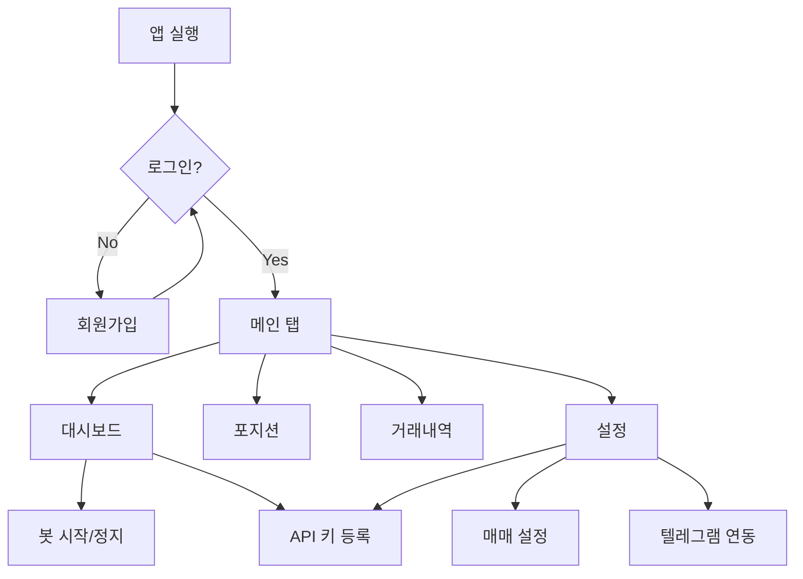

# 화면 플로우 및 와이어프레임 — 배짱이 v1.0

**저작자**: 차리 (challychoi@me.com)  
**문서 버전**: v1.0  
**작성일**: 2026-03-02  
**UI 가이드**: [One UI 디자인 가이드](c:\Users\chall\Desktop\myProject\ui-ux 가이드\oneui_design_guide_kor.pdf)

---

## 1. 화면 플로우



---

## 2. 화면 목록

| 화면 | 경로 | 설명 |
|------|------|------|
| 로그인 | /login | 이메일, 비밀번호 |
| 회원가입 | /register | 이메일, 비밀번호, 닉네임 |
| 대시보드 | / (메인) | 봇 상태, 수익률, 포지션 요약 |
| 포지션 | /positions | 보유 코인 상세 |
| 거래내역 | /trades | 매수/매도 내역 |
| 설정 | /settings | API 키, 매매 설정, 텔레그램 |

---

## 3. 하단 네비게이션 (One UI 4~5개)

| 탭 | 아이콘 | 라벨 |
|----|--------|------|
| 1 | home | 대시보드 |
| 2 | wallet | 포지션 |
| 3 | list | 거래내역 |
| 4 | settings | 설정 |

---

## 4. 와이어프레임 개요

### 4.1 로그인 화면
```
┌─────────────────────────────┐
│        [앱 로고]             │
│                              │
│  ┌──────────────────────┐   │
│  │ 이메일                │   │
│  └──────────────────────┘   │
│  ┌──────────────────────┐   │
│  │ 비밀번호              │   │
│  └──────────────────────┘   │
│                              │
│  ┌──────────────────────┐   │
│  │      로그인           │   │  ← Contained 버튼
│  └──────────────────────┘   │
│                              │
│  회원가입                    │
└─────────────────────────────┘
```

### 4.2 대시보드
```
┌─────────────────────────────┐
│  대시보드          [더보기]  │  ← App bar
├─────────────────────────────┤
│  ┌─────────────────────┐    │
│  │ 🟢 실행중  상승장    │    │  ← 봇 상태 카드
│  │ [정지]              │    │
│  └─────────────────────┘    │
│                              │
│  ┌──────┐ ┌──────┐ ┌──────┐ │
│  │일일   │ │주간   │ │승률   │ │  ← 수익률 카드
│  │+2.3% │ │+5.1% │ │58%   │ │
│  └──────┘ └──────┘ └──────┘ │
│                              │
│  보유 포지션                  │
│  ┌─────────────────────┐    │
│  │ BTC  0.001  +3.2%   │    │
│  │ ETH  0.5    -1.1%   │    │
│  └─────────────────────┘    │
├─────────────────────────────┤
│ [대시보드] [포지션] [거래] [설정] │  ← Bottom nav
└─────────────────────────────┘
```

### 4.3 설정 화면
```
┌─────────────────────────────┐
│  설정              [뒤로]   │
├─────────────────────────────┤
│  API 키 관리                 │
│  ┌─────────────────────┐    │
│  │ 메인계정 ****abcd    │    │
│  │ [삭제]    [추가]     │    │
│  └─────────────────────┘    │
│                              │
│  매매 설정                   │
│  투자 비율      [====●===] 50% │
│  최대 포지션    [  7  ]     │
│  손절 %         [ 2.5 ]     │
│  익절 %         [ 7.0 ]     │
│                              │
│  텔레그램 연동               │
│  Chat ID        [        ]   │
└─────────────────────────────┘
```

---

## 5. One UI 적용 사항

| 항목 | 적용 |
|------|------|
| 구조 | 보는 영역(상단) / 인터랙션 영역(하단) 구분 |
| 여백 | 좌우 24dp 이상 |
| 버튼 | 주요 액션: Contained, 툴바: Flat |
| 다이얼로그 | 화면 하단에서 위로 |
| 다크 모드 | 지원 |
| 하단 네비 | 4개, 아이콘+텍스트 |
